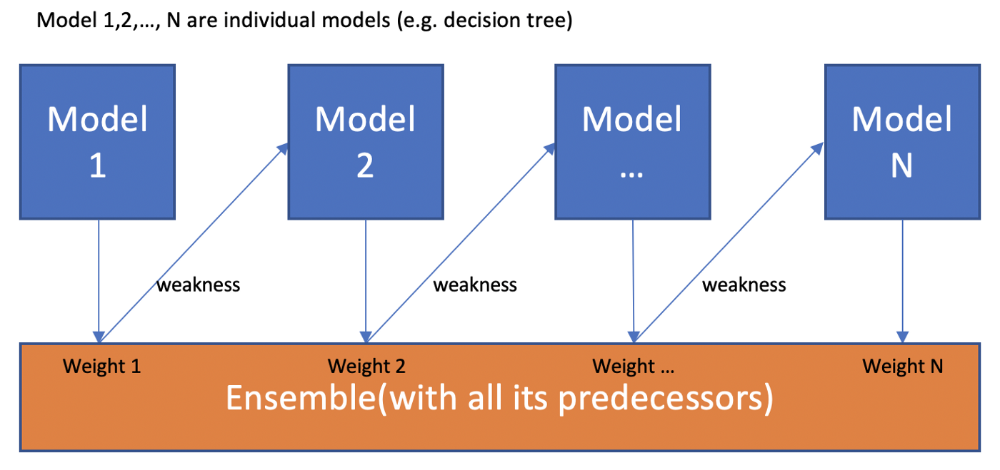
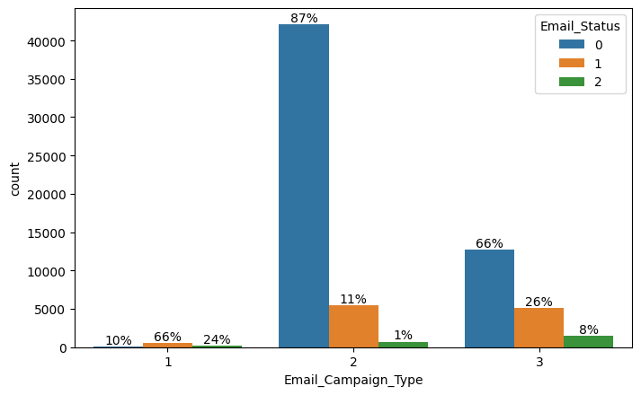
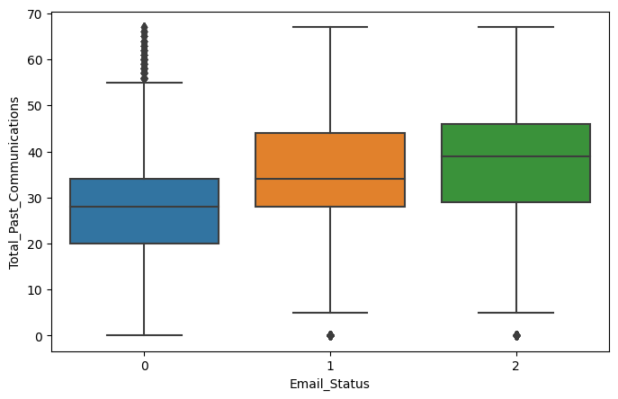
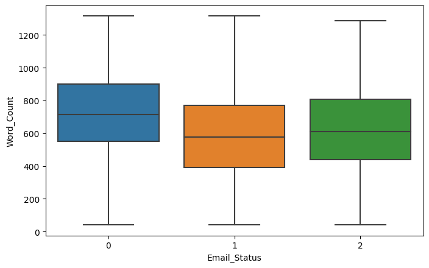
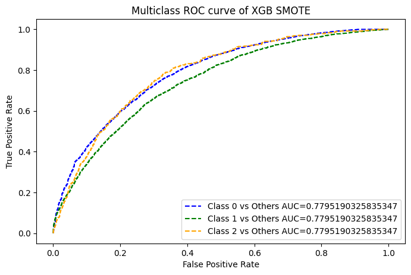

 
  

<h1 align="center"> Email Campaign Effectiveness Prediction </h1>
<h3 align="center"> AlmaBetter Verfied Project - <a href="https://www.almabetter.com/"> AlmaBetter School </a> </h5>

 

<h2> Problem Statement and Project Description</h2>

Most of the small to medium business owners are making effective use of Gmail-based Email marketing Strategies for offline targeting of converting their prospective customers into leads so that they stay with them in Business. The main objective is to create a machine learning model to characterize the mail and track the mail that is ignored; read; acknowledged by the reader. 

Email advertising is the act of sending promotional emails to customers in mass quantities. It commonly is to generate income or leads and it can include advertising. Most importantly, email marketing allows businesses to build relationships with leads, new customers and past customers. It's a way to communicate directly to the customers in their inbox, at a time that is convenient for them. With the right messaging tone and strategies, emails are one of the most important marketing channels.

Email campaign effectiveness is a way of analyzing the kind of email campaigns being run by businesses in order to carry out their marketing and promotional agendas and hence they need to know how well the campaign is working.

The work here characterizes and predicts the emails if they are going to be ignored; read; acknowledged on the basis of the various features related to the emails in the dataset and makes recommendations to lower the number of ignored emails.

<h2> :floppy_disk: Project Files Description</h2>

This project contains one executable file, a technical document and a presentation as follows:

<h4>Executable Files:</h4>
<ul>
  <li><b>Email_Campaign_Effectiveness_Prediction_Vithika_Karan.ipynb</b> - Complete Google Collab notebook containing data summary, exploration, visualisations, modeling, evaluation, conclusion and recommendations.</li>
</ul>

<h4>Documentation:</h4>
<ul>
  <li><b>Technical Documentation.pdf</b> - Includes the complete documentation about the project.</li>
  <li><b>Project Presentation.pdf</b> - Presentation of the same.</li>
</ul>

<h2> :book: XG Boost</h2>

Extreme Gradient Boosting is abbreviated as XgBoost. It is a classification and regression technique that uses the Boosting Ensemble Learning Technique. Boosting is an ensemble modeling strategy that aims to create a strong classifier from a collection of weak ones. It's done by stringing together weak models to create a model. To begin, a model is created using the training data. The second model is then created, which attempts to correct the faults in the previous model. This approach is repeated until either the entire training data set is properly predicted or the maximum number of models has been added. Here is a representation of Boosting.

In XGBoost, weights are very significant. All of the independent variables are given weights, which are subsequently fed into the decision tree, which predicts outcomes. The weight of factors that the tree predicted incorrectly is increased, and these variables are fed into the second decision tree. Individual classifiers/predictors are then combined to form a more powerful and precise model. It can be used to solve problems including regression, classification, ranking, and user-defined prediction.

<h2> :chart_with_upwards_trend: Exploratory Data Analysis</h2>

In the Email Campaign Type feature, it seems like in campaign type 1 very few emails were sent but has a very high likelihood of getting read. Most emails were sent under email campaign type 2 and most ignored. Seems like campaign 3 was a success as even when less number of emails were sent under campaign 3, more emails were read and acknowledged.

Analyzing total past communications, we can see that the more the number of previous emails, the more it leads to read and acknowledged emails. This is just about making connection with your customers. 

The more the words in an email, the more it has a tendency it has to get ignored. Too lengthy emails are getting ignored.

 
 

<h2> :chart_with_upwards_trend: Results</h2>

 Imbalanced Class Handling techniques such as Undersampling and SMOTE were done after train-test split only on the training data, to make sure that the model doesn't catch up to the test set at all and it remains unknown which somewhat reduced our results.

It is observed that SMOTE worked considerably better than Random Undersampling, it may have led to loss of information.

Decision Tree Model is overfitting. It is working really great on train data and worse on test data.

XGBoost Algorithm worked in the best way possible with such imbalanced data with outliers with F1 Score of 0.77 on the test set.

<!-- CREDITS -->
<h2 id="credits"> :scroll: Credits</h2>

< Vithika Karan > | Keen Learner | Business Analyst | Data Scientist | Machine Learning Enthusiast

 <i> Contact me for Data Science Project Collaborations</i>

<h2> :books: References</h2>
<ul>
  <li>
Bex T., 'Beginner's Guide to XG Boost'. [Online].

      
Available: https://towardsdatascience.com/beginners-guide-to-xgboost-for-classification-problems-50f75aac5390

  </li>
  <li>
Zixuan Zhang, 'Boosting Algorithms Explained'. [Online].

      
Available: https://towardsdatascience.com/boosting-algorithms-explained-d38f56ef3f30

  </li>
  <li>
GeeksforGeeks, 'XGBoost'. [Online].

      
Available: https://www.geeksforgeeks.org/xgboost/

  </li>

